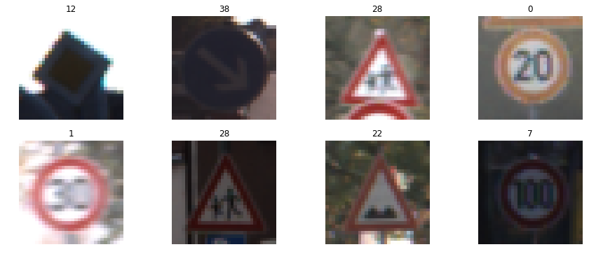
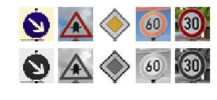

# **Traffic Sign Recognition** 

## Writeup
## Rubric Points
### Here I will consider the [rubric points](https://review.udacity.com/#!/rubrics/481/view) individually and describe how I addressed each point in my implementation.  

---
### Writeup / README

#### 1. Provide a Writeup / README that includes all the rubric points and how you addressed each one. You can submit your writeup as markdown or pdf. You can use this template as a guide for writing the report. The submission includes the project code.

You're reading it! and here is a link to my [project code](https://github.com/deidaraho/CarND-Traffic-Sign-Classifier-Project/blob/master/Traffic_Sign_Classifier.ipynb)

### Data Set Summary & Exploration

#### 1. Provide a basic summary of the data set. In the code, the analysis should be done using python, numpy and/or pandas methods rather than hardcoding results manually.

I used the pandas library to calculate summary statistics of the traffic
signs data set:

* The size of training set is 34799
* The size of the validation set is 4410
* The size of test set is 12630
* The shape of a traffic sign image is (32, 32, 3)
* The number of unique classes/labels in the data set is 43

#### 2. Include an exploratory visualization of the dataset.

Here is an exploratory visualization of the data set. 
Pre-view shows some samples from the data set.

Label-distribution is a bar chart discribes the distribution of the frequencies to different signs.

### Design and Test a Model Architecture

#### 1. Describe how you preprocessed the image data. What techniques were chosen and why did you choose these techniques? Consider including images showing the output of each preprocessing technique. Pre-processing refers to techniques such as converting to grayscale, normalization, etc. (OPTIONAL: As described in the "Stand Out Suggestions" part of the rubric, if you generated additional data for training, describe why you decided to generate additional data, how you generated the data, and provide example images of the additional data. Then describe the characteristics of the augmented training set like number of images in the set, number of images for each class, etc.)

As a first step, I decided to convert the images to grayscale because the LeNet discussed during tutorial is based on gray input.

Here is an example of a traffic sign image before and after grayscaling, it is not from the data set but from the third section from online searching.

As a last step, I normalized the image data because to get rid of bias for traning and testing.

#### 2. Describe what your final model architecture looks like including model type, layers, layer sizes, connectivity, etc.) Consider including a diagram and/or table describing the final model.

My final model consisted of the following layers:

| Layer         		|     Description	        					| 
|:---------------------:|:---------------------------------------------:| 
| Input         		| 32x32x1 gray image   							| 
| Convolution 5x5x1x6   | 1x1x1x1 stride, valid padding, outputs 28x28x6|
| RELU					|												|
| Max pooling	      	| 2x2 stride,  outputs 14x14x16 				|
| Convolution 5x5x6x16	| 1x1x1x1 stride, valid padding,outputs 10x10x16|
| RELU					|												|
| Max pooling	      	| 2x2 stride,  outputs 5x5x16, mark: layer2 	|
| Convolution 5x5x16x400| 1x1x1x1 stride, valid padding,outputs 1x1x400 |
| RELU					| mark: layer3  								|
| flat Layer3 		    | mark: flaten3									|
| flat Layer2 		    | mark: flaten2									|
| concat flaten2 & 3 	| outputs 800									|
| dropout 	            |           									|
| Fully connected		| etc.        									|
| Softmax				| etc.        									|

The flowchart from online is as follows,

#### 3. Describe how you trained your model. The discussion can include the type of optimizer, the batch size, number of epochs and any hyperparameters such as learning rate.

To train the model, the parameters used are listed as follows,
    type of optimizer: Adam
    learning rate: 0.001
    the batch size: 128
    number of epochs: 50
    keep rate for dropout: 100%

#### 4. Describe the approach taken for finding a solution and getting the validation set accuracy to be at least 0.93. Include in the discussion the results on the training, validation and test sets and where in the code these were calculated. Your approach may have been an iterative process, in which case, outline the steps you took to get to the final solution and why you chose those steps. Perhaps your solution involved an already well known implementation or architecture. In this case, discuss why you think the architecture is suitable for the current problem.

My final model results were:
* training set accuracy of 100%
* validation set accuracy of 95.4%
* test set accuracy of 94.0%

I am using a modified LeNet model from Sermanet/LeCunn traffic sign classification journal article,
Traffic Sign Recognition with Multi-Scale Convolutional Networks
http://yann.lecun.com/exdb/publis/pdf/sermanet-ijcnn-11.pdf

The model is based and validated based on serval popular trafic sign open source data set and review by both acamedic and industrial peers, so I am thinking it as a good start point.
Moreover, the accuracies in validation and test data set confirm my try in this model.
 

### Test a Model on New Images

#### 1. Choose five German traffic signs found on the web and provide them in the report. For each image, discuss what quality or qualities might be difficult to classify.

Here are five German traffic signs that I found on the web:

The last two images might be difficult to classify because they are similar format with different speed limits.

#### 2. Discuss the model's predictions on these new traffic signs and compare the results to predicting on the test set. At a minimum, discuss what the predictions were, the accuracy on these new predictions, and compare the accuracy to the accuracy on the test set (OPTIONAL: Discuss the results in more detail as described in the "Stand Out Suggestions" part of the rubric).

Here are the results of the prediction:

| Image			        |     Prediction	        					        | 
|:---------------------:|:-----------------------------------------------------:| 
| Keep right      		| Keep right  									        | 
| Right-of-way at the next intersection |  Right-of-way at the next intersection|
| Priority road			| Priority road									        |
| 60 km/h	      		| 30 km/h    					 				        |
| 30 km/h			    | 30 km/h           							        |

The model was able to correctly guess 4 of the 5 traffic signs, which gives an accuracy of 80%. 
The accuracy diffference to the test data set may because,
1, the training data pre-processing, I did not do further augmentation, such as include noised signs.
2, the label's frequency bias as shown before, which leads to the model fails to distinguish similar format signs with defferent digits.

#### 3. Describe how certain the model is when predicting on each of the five new images by looking at the softmax probabilities for each prediction. Provide the top 5 softmax probabilities for each image along with the sign type of each probability. (OPTIONAL: as described in the "Stand Out Suggestions" part of the rubric, visualizations can also be provided such as bar charts)

The code for making predictions on my final model is located in the 11th cell of the Ipython notebook.

For the first image, the model is relatively sure that this is a stop sign (probability of 1.0), and the image does contain a stop sign. The top five soft max probabilities were

| Probability         	|     Prediction	        					| 
|:---------------------:|:---------------------------------------------:| 
| 1.0         			| Keep right                            		| 

For the second image,

| Probability         	|     Prediction	        					| 
|:---------------------:|:---------------------------------------------:| 
| 1.0         			| Right-of-way at the next intersection   		| 

For the third image,

| Probability         	|     Prediction	        					| 
|:---------------------:|:---------------------------------------------:| 
| 1.0         			|Priority road                           		|

For the 4th image,

| Probability         	|     Prediction	        					| 
|:---------------------:|:---------------------------------------------:| 
| 8.9219403e-01			|30km/h                                 		|
| 1.0591247e-01			|60km/h                                 		|
| 1.6621478e-03			|Wild animals crossing                    		|
| 1.5945002e-04			|80km/h                                 		|
| 4.0532828e-05			|Keep right                              		|

For the 5th image,

| Probability         	|     Prediction	        					| 
|:---------------------:|:---------------------------------------------:| 
| 9.9999988e-01			|30km/h                                 		|
| 6.6931619e-08			|50km/h                                 		|
| 6.6172482e-21			|80km/h                                 		|
| 5.2142040e-22			|20km/h                                 		|
| 1.8471558e-23			|Wild animals crossing                    		|

The last two signs' top 5 classification probabilites show the model is week to clasify exact digit on speed limit signs. A future improvement is to apply an iterative classifier which focuses on only speed limit signs. Once the current model determines a speed limit sign, the photo is sent the this new classifier to determine its speed.